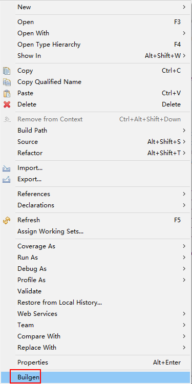

# Builgen-plugin
Builgen plugin for eclipse and idea.Generate code for Java bean builder design pattern.

[TOC]

## How to use
### eclipse
> Test environment:`JDK 1.8` + `Eclipse Oxygen Release (4.7.0)`

1. Copy [`Builgen_1.0.0.201708310007.jar`](https://github.com/Vabshroo/Builgen-plugin/blob/master/eclipse/Builgen/Builgen_1.0.0.201708312118.jar) to eclipse `plugins` directory.
2. Delete `eclipse\configuration\org.eclipse.update` directory.
3. Rerun eclipse with `-clean` option(Windows:`cmd->cd $dir_eclipse.exe->run cmd 'eclipse -clean'`).
4. Create a Java bean like this.
    ```java
    public class TestBean {
        private String mes;
        private int[] inteters;
        private List<String> strings;
        private List<Map<String, Object>> ddd;
        private boolean klk;
        private double dst;
    }
    ```
5. Right click on file,click `Builgen` at the end.

    
    
6. Content will be replaced by generated code.
    ```java
    public class TestBean {
        private String mes;
        private int[] inteters;
        private List<String> strings;
        private List<Map<String, Object>> ddd;
        private boolean klk;
        private double dst;

        public TestBean(TestBean testBean) {
            this.mes = testBean.getMes();
            this.inteters = testBean.getInteters();
            this.strings = testBean.getStrings();
            this.ddd = testBean.getDdd();
            this.klk = testBean.getKlk();
            this.dst = testBean.getDst();
        }

        public TestBean() {
        }

        public static class TestBeanBuilder {
            TestBean testBean;

            public TestBeanBuilder() {
                testBean = new TestBean();
            }

            public TestBeanBuilder mes(String mes) {
                testBean.setMes(mes);
                return this;
            }

            public TestBeanBuilder inteters(int[] inteters) {
                testBean.setInteters(inteters);
                return this;
            }

            public TestBeanBuilder strings(List<String> strings) {
                testBean.setStrings(strings);
                return this;
            }

            public TestBeanBuilder ddd(List<Map<String, Object>> ddd) {
                testBean.setDdd(ddd);
                return this;
            }

            public TestBeanBuilder klk(boolean klk) {
                testBean.setKlk(klk);
                return this;
            }

            public TestBeanBuilder dst(double dst) {
                testBean.setDst(dst);
                return this;
            }

            public TestBean build() {
                return new TestBean(this.testBean);
            }
        }

        public void setDst(double dst) {
            this.dst = dst;
        }

        public double getDst() {
            return this.dst;
        }

        public void setKlk(boolean klk) {
            this.klk = klk;
        }

        public boolean getKlk() {
            return this.klk;
        }

        public void setDdd(List<Map<String, Object>> ddd) {
            this.ddd = ddd;
        }

        public List<Map<String, Object>> getDdd() {
            return this.ddd;
        }

        public void setStrings(List<String> strings) {
            this.strings = strings;
        }

        public List<String> getStrings() {
            return this.strings;
        }

        public void setInteters(int[] inteters) {
            this.inteters = inteters;
        }

        public int[] getInteters() {
            return this.inteters;
        }

        public void setMes(String mes) {
            this.mes = mes;
        }

        public String getMes() {
            return this.mes;
        }
    }
    ```
### idea
> Test environment:`JDK 1.8` + `INTELLIJ IDEA COMMUNITY 2017.2.1`

1. Download [Builgen.jar](https://github.com/Vabshroo/Builgen-plugin/blob/master/idea/Builgen/Builgen.jar)
2. `File -> Settings -> plugins -> Install Plugins From Disk`,choose the jar downloaded,then restart idea.
3. New class and right click inside editor for context menu,then `Generate -> Builgen`.

    
    
4. Builder class lost modifier `static`,add if necessary.
